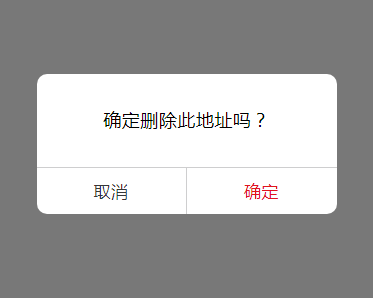

## 移动端消息提示框、模态对话框


* [在线预览](https://annamayyan.github.io/mobile-toast/demo.html)
<p>
  
</p>  

模态对话框使用

属性 | 类型 | 默认值 | 必填 | 说明
---------- | ----------- | ----------- | ------------ | -----------
title | String |  | 否 | 提示的内容 
showCancel | Boolean | true | 否 | 是否显示取消按钮

示例
```javascript
var delDialog = new dialog({ 
	title: '提示的内容',
	showCancle: 
	confirmColor: 'green',
	success: function(res) {
		if(res.confirm) {
			console.log('用户点击确定');
		} else if (res.cancle) {
			console.log('用户点击了取消');
		}
	}
});
```


